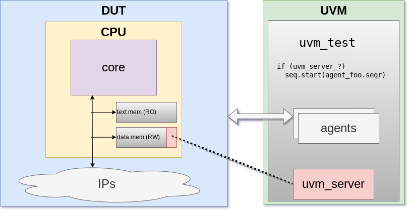

# uvm_training - risc-v
Write system-level tests in C, make them communicate with a UVM server

# TODO
  - support nested wait_event
    - use dedicated wait_event_address
    - 1 bit per index
    - SW clear bit when done
  - put all uvm_server fucntions in uvm_server.sv (no split in test + uvm_server.sv)
  - make monitor appear in the png

# Agenda

## III- Practical Case Study: RiscV
### day1: architecture and API
  - why co-simulation?
  - explain the architecture
    - address range in RAM
      - C write -> monitor -> action
      - SV backdoor write -> C read -> action
  - code API
### day2: my first command
  - look at the linker script + uvm_server __attribute__
  - look at the interface + monitor + sequence_item
  - implement uvm_server_quit()
### day3: C->UVM
  - implement uvm_print_\*()
    - va_arg
    - string in text_memory
  - void uvm_server_gen_event(uint32_t event_idx);
    - uvm_event
  - void uvm_server_push_data(uint32_t fifo_idx, uint32_t data);
### day4: UVM->C
  - void uvm_server_wait_event(uint32_t event_idx);
  - bool uvm_server_pull_data(uint32_t fifo_idx, uint32_t \*data);
### day5: to go further
  - nested wait_event
  - use registers instead of RAM
  - uvm_server in a TB ram
