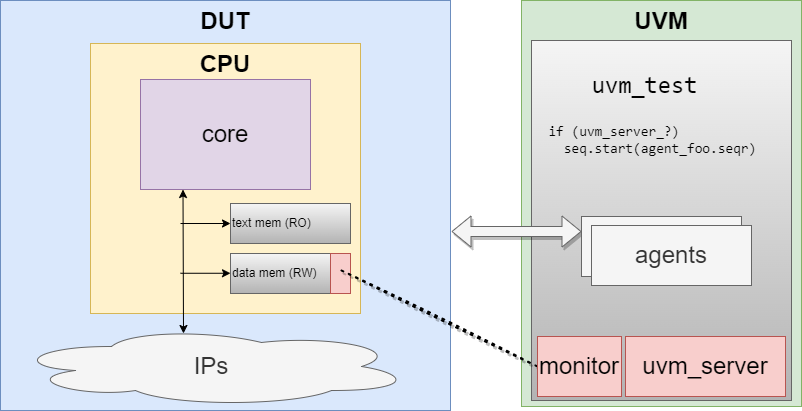

# uvm_training - risc-v
C-UVM co-simulation : write system-level tests in C, make them communicate with UVM




# TODO
  - add check on fifo size
  - pass plusarg and option to xrun
  - add more tests
  - vif with multiple mem types


# Agenda

## III- Practical Case Study: RiscV
### day1: architecture and API
  - why co-simulation?
    - reuse C code on emulator/FPGA/ASIC
    - SW engineers can now code tests
  - explain the architecture
    - address range in RAM
      - C write -> monitor -> action
      - SV backdoor write -> C read -> action
  - code API
    - C side
      - look at uvm_sw_ipc.h and uvm_sw_ipc.c
      - look at the linker script + uvm_sw_ipc __attribute__
    - SV/UVM side
      - look at top_th.sv, uvm_sw_ipc_config.sv and uvm_sw_ipc.sv
      - look at the interface + monitor + sequence_item
### day2: my first command
  - implement the following function:
```c
void uvm_sw_ipc_quit(void);
```
    - test with **./run quit_test**
### day3: C->UVM
  - implement the following functions:
```c
void uvm_sw_ipc_print_info(uint32_t arg_cnt, char const *const str,  ...);
void uvm_sw_ipc_print_warning(uint32_t arg_cnt, char const *const str,  ...);
void uvm_sw_ipc_print_error(uint32_t arg_cnt, char const *const str,  ...);
void uvm_sw_ipc_print_fatal(uint32_t arg_cnt, char const *const str,  ...);
`````
    - va_arg
    - string in text_memory
    - test with **./run print_test**
  - implement the following functions and their UVM counterparts:
  ```c
void uvm_sw_ipc_gen_event(uint32_t event_idx);
void uvm_sw_ipc_push_data(uint32_t fifo_idx, uint32_t data);
  ```
    - uvm_event, queues
    - test with **./run gen_event_test** and **./run push_data_test**
### day4: UVM->C
  - implement the following functions and their UVM counterparts:
```c
void uvm_sw_ipc_wait_event(uint32_t event_idx);
bool uvm_sw_ipc_pull_data(uint32_t fifo_idx, uint32_t \*data);
```
    - test with **./run wait_event_test** and **./run pull_data_test**
### day5: to go further
  - test everything works with **./run basic_test**
  - discussion
    - IRQ, multi-threading
    - use registers instead of RAM
    - uvm_sw_ipc in a TB ram
